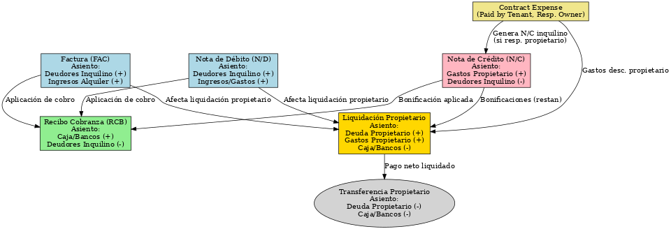

# Flujo de Liquidación al Propietario con Asientos Contables

Este documento describe el flujo completo desde la emisión de comprobantes hasta la liquidación al propietario, incluyendo los asientos contables de cada etapa.

---

## 1️⃣ Factura (FAC)
- **Asiento contable:**
  ```
  Deudores por alquiler (Inquilino)      (+)
      Ingresos por alquileres                (+)
  ```

---

## 2️⃣ Nota de Débito (N/D)
- **Asiento contable:**
  ```
  Deudores por alquiler (Inquilino)      (+)
      Ingresos/Gastos asociados               (+)
  ```

---

## 3️⃣ Nota de Crédito (N/C)
- **Generada por bonificación o gasto pagado por el inquilino y a cargo del propietario.**
- **Asiento contable:**
  ```
  Gastos a cargo propietario               (+)
      Deudores por alquiler (Inquilino)        (-)
  ```

---

## 4️⃣ Recibo de Cobranza (RCB)
- **Aplicación de pagos a FAC/N/D/N/C.**
- **Asiento contable:**
  ```
  Caja/Bancos (Inmobiliaria)             (+)
      Deudores por alquiler (Inquilino)      (-)
  ```

---

## 5️⃣ Contract Expenses
- Si `paid_by=tenant` y `responsible_party=owner`: genera N/C al inquilino y descuento en liquidación.
- Si `paid_by=agency` y `responsible_party=owner`: se descuenta al propietario en la liquidación.

---

## 6️⃣ Liquidación al Propietario (LIQ)
- Incluye ingresos de FAC/N/D (que afectan propietario), bonificaciones N/C (restan) y gastos a cargo propietario.
- **Asiento contable:**
  ```
  Deuda con propietario                  (+)
  Gastos a cargo propietario             (+)
      Caja/Bancos (Inmobiliaria)             (-)
  ```

---

## 7️⃣ Transferencia al propietario
- **Asiento contable:**
  ```
  Deuda con propietario                  (-)
      Caja/Bancos (Inmobiliaria)             (-)
  ```

---

## Diagrama visual


---

## Resumen funcional
1. **FAC/N/D:** Generan deuda al inquilino y luego cobranza con RCB.
2. **N/C:** Reduce deuda del inquilino y renta del propietario.
3. **Contract expenses:** Ajustan liquidación según responsable.
4. **Liquidación:** Suma ingresos, descuenta bonificaciones, gastos y comisiones.
5. **Pago final:** Se transfiere al propietario el neto resultante.
