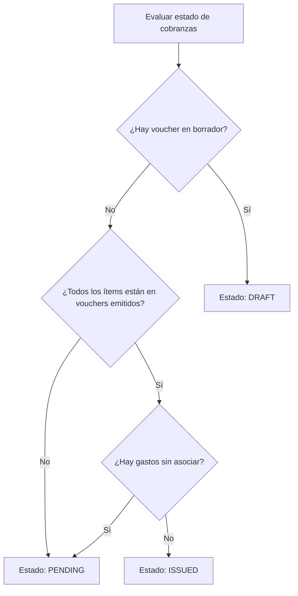

# 🗂 Pantalla: Listado de Cobranzas (Collections)

## 1️⃣ Ruta y componente
- **Ruta:** `/collections`
- **Componente principal:** `CollectionIndex.vue`
- Punto de acceso: Menú **"Collections"** (Cobranzas).

---

## 2️⃣ Objetivo
Centralizar en una sola vista la gestión de cobranzas mensuales, permitiendo:
- Listar contratos con cobranzas pendientes para un período dado.
- Visualizar cobranzas en borrador y emitidas.
- Detectar gastos no facturados y gestionar su inclusión.

---

## 3️⃣ Estructura visual

### Encabezado (filtros):
- **Período (obligatorio):** selector mes/año.
- **Estado:** Pending / Draft / Issued.
- **Contrato:** Autocomplete (`ContractAutocomplete`).
- **Cliente (Tenant):** Autocomplete (`ClientAutocomplete`).
- **Moneda:** ARS / USD.

### Tabla:
Columnas principales:
1. Contrato (link a `/contracts/:id`).
2. Tenant principal.
3. Período.
4. Estado cobranza (Pending / Draft / Issued).
5. Total estimado (renta + gastos).
6. Última cobranza generada.
7. Acciones contextuales:
   - **Generate Collection** (si Pending).
   - **Edit Draft** (si Draft).
   - **Manage new expenses** (si Draft con gastos nuevos).
   - **View Details** (si Issued).

---

## 4️⃣ Estados de cobranzas

### Pending
- No existe ningún voucher emitido ni borrador para el período.
- Representa la situación inicial del mes.

### Draft
- Hay al menos un voucher en borrador para el período.
- Puede incluir renta y gastos cargados hasta el momento.
- Si surgen nuevos gastos, se agregan al borrador o generan nuevos vouchers.

### Issued
- Todos los ítems esperados están asociados a vouchers emitidos (FAC/N/D).
- No hay borradores ni gastos pendientes.

---

## 5️⃣ Casos intermedios importantes
1. **Vouchers emitidos + borradores pendientes:**
   - Estado: **Draft.**

2. **Vouchers emitidos pero gastos nuevos sin asociar:**
   - Estado: **Draft** hasta incluirlos.

3. **Múltiples vouchers emitidos (FAC + N/D):**
   - Estado: **Issued** si todos los ítems están cubiertos.

---

## 6️⃣ Diagrama de decisión de estados

---

## 7️⃣ Endpoints Backend
- `GET /collections` → lista contratos y su estado de cobranza.
  - Params: `period`, `status`, `contract_id`, `client_id`, `currency`.
- `GET /collections/:id` → detalle de una cobranza (emitida o borrador).

---

## 8️⃣ Componentes Vue
- `CollectionIndex.vue`: Vista principal.
- `CollectionTable.vue`: Tabla con estados y acciones.
- `ContractAutocomplete.vue`: Selector de contrato.
- `ClientAutocomplete.vue`: Selector de cliente.

---

## 9️⃣ Acciones
- **Generate Collection:** Abre `CollectionEditor.vue` para crear FAC X del período.
- **Edit Draft:** Abre editor con ítems precargados.
- **Manage New Expenses:** Detecta gastos nuevos posteriores.
- **View Details:** Vista en solo lectura de vouchers emitidos.
