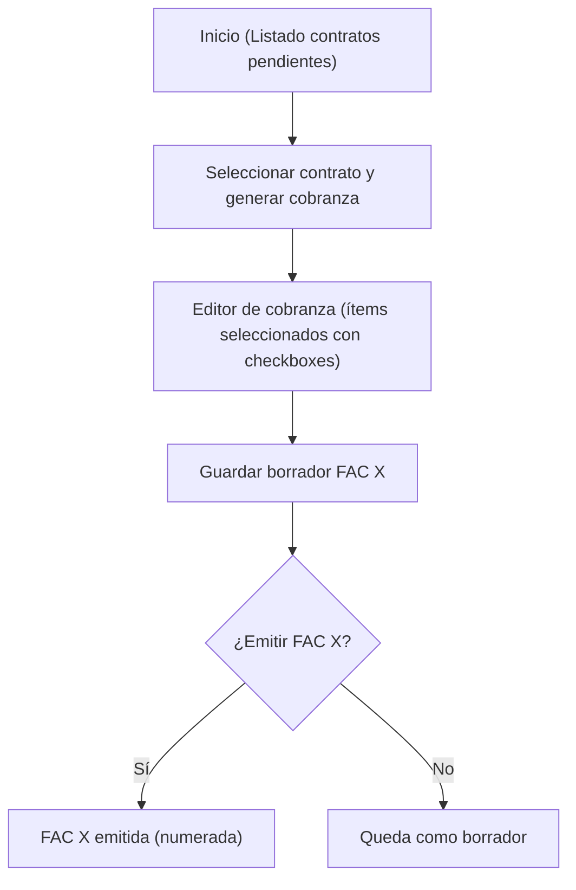
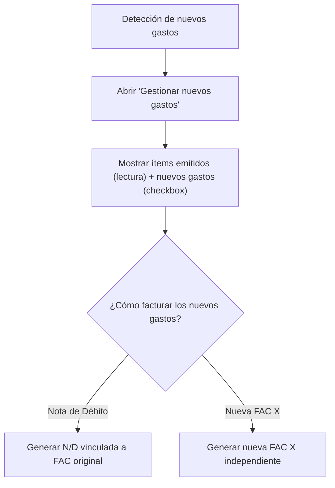
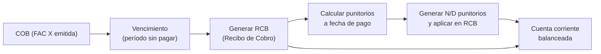
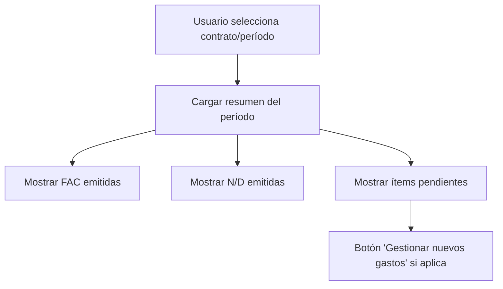

# 📄 Módulo: Gestión de Cobranzas

## 1️⃣ Objetivo
Centralizar la **generación mensual de cobranzas** por contrato, incluyendo:
- **Renta mensual.**
- **Comisiones recurrentes.**
- **Gastos de contrato (`ContractExpenses`).**
- **Punitorios calculados dinámicamente al pago.**
- Control de **nuevos gastos posteriores** con soporte para N/D o nuevas FAC X.

Este módulo garantiza trazabilidad total, soporte multimoneda y gestión flexible de ítems antes de emitir comprobantes.

---

## 2️⃣ Alcance
- Comprobantes generados: **FAC X** y **N/D X** (internos).
- Un voucher por contrato y moneda.
- Estados:  
  - `borrador` → editable.  
  - `emitido` → numerado y bloqueado.  
  - `cobrado` → vinculado a recibo (RCB).

---

## 3️⃣ Flujo funcional

### A. Listado de pendientes
- Vista con contratos, período, monedas, estado de cobranza y total pendiente.
- Acciones:
  - **Generar cobranza:** nuevo voucher FAC X.
  - **Editar borrador:** modificar ítems previos.
  - **Gestionar nuevos gastos:** detectar gastos posteriores a FAC emitida.

---

### B. Editor de cobranza
- Encabezado: contrato, período, moneda, estado.
- Tabla de ítems:
  - ✅ Checkbox (seleccionado por defecto según estado).
  - Descripción.
  - Tipo (Renta, Comisión, Gasto, Punitorio, Manual).
  - Importe editable (excepto renta).
  - Origen: borrador, nuevo, emitido (solo lectura).

**Comportamiento de ítems:**
- **Renta:** marcada y bloqueada.
- **Incluido en borrador:** marcado ✅ editable.
- **Nuevo gasto:** marcado ✅ editable.
- **Punitorios (estimados):** visibles solo como referencia previa.
- **Ítems emitidos:** lectura.

Acciones:
- **Agregar ítem manual.**
- **Guardar borrador.**
- **Emitir FAC X.**

---

### C. Nuevos gastos posteriores
- Si hay FAC emitida y surgen gastos:
  - Mostrar ítems emitidos en modo lectura.
  - Mostrar nuevos gastos con checkbox ✅.
  - Opciones:
    - Emitir **N/D vinculada** a FAC original.
    - Emitir **nueva FAC X independiente.**

---

### D. Vista Resumen de Cobranzas del Período
- Contrato y período seleccionados.
- Tabla de comprobantes emitidos:
  - FAC y N/D con fecha, moneda, ítems.
  - Estado (emitido o cobrado).
- Ítems pendientes no facturados.
- Botón **"Gestionar nuevos gastos"** si corresponde.

Filtros:
- Contrato, período, estado, moneda.

---

## 4️⃣ Flujo de punitorios
### Regla principal:
- **COB (FAC X) NO incluye punitorios.**
- Los punitorios se calculan **al momento del pago (RCB)**.

### Flujo:
1. **COB mensual emitida (FAC X)**:
   - Incluye renta, comisiones y gastos.
   - No incluye punitorios.
2. **RCB (recibo de pago):**
   - Se calcula mora desde fecha de vencimiento hasta fecha de pago.
   - El sistema genera automáticamente una **N/D de punitorios**.
   - La N/D se aplica en el mismo recibo junto a la FAC y pagos.
3. **Resultado:**
   - Cuenta corriente balanceada: FAC + N/D punitorios - pagos = saldo cero.

### Configuración:
- Tasa diaria configurable en parámetros globales.
- Vista previa en RCB:  
  > "Deuda al día + Punitorios calculados: $X".

---

## 5️⃣ Multimoneda
- Un voucher por moneda:
  - Renta y gastos en ARS → FAC X en ARS.
  - Gastos en USD → FAC X en USD.
- Punitorios se calculan en la moneda de la deuda.
- RCB genera N/D punitorios en la moneda correspondiente.

---

## 6️⃣ Backend

### Endpoint:
`POST /vouchers/generate`

Ejemplo de payload:
```json
{
  "contract_id": 1001,
  "period": "2025-09",
  "currency": "ARS",
  "items": [
    { "type": "rent", "description": "Renta Septiembre 2025", "amount": 150000 },
    { "type": "expense", "contract_expense_id": 12 },
    { "type": "manual", "description": "Honorarios", "amount": 5000 }
  ]
}
```

### Servicios:
- **`VoucherGenerationService`**
  - Calcula renta, comisiones.
  - Agrupa gastos por moneda.
  - Maneja borradores y emisión.
  - Vincula ítems facturados.

- **`PenaltyCalculationService`**
  - Calcula punitorios dinámicos para el RCB.
  - Genera N/D automática al confirmar el recibo.

---

## 7️⃣ Frontend
- **Pendientes de Cobranza:** listado general por contrato y moneda.
- **Editor de Cobranza:** checkboxes, importes editables, totales dinámicos.
- **Resumen de Cobranzas:** histórico del período.
- **Recibo (RCB):**
  - Muestra deuda vigente + punitorios calculados hoy.
  - Genera y aplica automáticamente N/D punitorios.

---

## 8️⃣ Beneficios
- ✅ Gestión centralizada de renta, gastos y punitorios.
- ✅ Cálculo de punitorios dinámico y preciso.
- ✅ Soporte multimoneda integrado.
- ✅ Flexibilidad total con vouchers borrador, N/D y ajustes automáticos.
- ✅ Transparencia: vista de resumen con trazabilidad completa.

---


## 9️⃣ Diagramas complementarios

### 9.1 Flujo de generación de FAC X mensual


### 9.2 Flujo de nuevos gastos posteriores (FAC/N/D)


### 9.3 Flujo de punitorios dinámicos en RCB


### 9.4 Resumen de cobranzas del período

