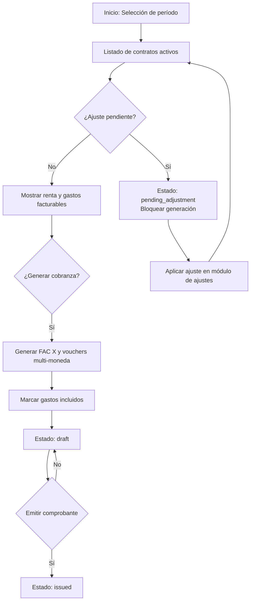

# Módulo: Gestión de Cobranzas

## 1️⃣ Objetivo
El módulo de **Gestión de Cobranzas** permite generar, controlar y emitir las cobranzas mensuales a los inquilinos, integrando automáticamente:
- La renta mensual del contrato.
- Los gastos correspondientes a responsabilidad del inquilino (`owner → tenant`, `agency → tenant`).
- Control de ajustes pendientes de aplicar.
- Soporte para múltiples monedas, generando un voucher por cada moneda involucrada.
- Exclusión de gastos no cobrables al inquilino (`tenant → tenant`, `tenant → owner`, `owner → owner`, `agency → owner`).

---

## 2️⃣ Flujo General
1. **Listado de pendientes**  
   - Muestra contratos activos en el período seleccionado.
   - Incluye renta calculada, gastos agrupados por moneda y estado de cobranza.
   - Si hay **ajustes pendientes**, se bloquea la generación de cobranza.

2. **Generación de cobranza**  
   - Genera una factura interna (`FAC X`) al inquilino por la renta y gastos en su moneda.
   - Si hay gastos en otras monedas, se generan vouchers separados.
   - Marca los `ContractExpenses` incluidos con `voucher_id`.

3. **Estados posibles**  
   - `pending`: contrato activo sin cobranza generada.
   - `pending_adjustment`: contrato con ajuste pendiente de aplicar (bloquea cobranza).
   - `draft`: existe un voucher en borrador (o gastos sin asociar a vouchers emitidos).
   - `issued`: todos los gastos facturables están asociados a vouchers emitidos.

4. **Punitorios dinámicos**  
   - Se calculan al momento de generar el recibo de pago (`RCB`), creando un comprobante de ajuste (`N/D`) automático que refleja el interés acumulado.

---

## 3️⃣ Reglas de Cálculo

### Renta
- Se obtiene de `Contract::calculateRentForPeriod($period)`.
- Si existe un ajuste:
  - Aplicado → usa `applied_amount`.
  - Pendiente → bloquea la cobranza (estado `pending_adjustment`).

### Gastos incluidos en la cobranza
- **Incluir**:
  - `owner → tenant`: propietario pagó gasto del inquilino.
  - `agency → tenant`: inmobiliaria adelantó gasto al inquilino.
- **Excluir**:
  - `tenant → tenant`: gasto validado, no facturable.
  - `tenant → owner`: genera NC al inquilino y luego va a liquidación.
  - `owner → owner` / `agency → owner`: sólo liquidación al propietario.

### Multi-moneda
- Se genera **un voucher por moneda**.
- La renta siempre va en la moneda del contrato.
- Los gastos en moneda distinta generan vouchers independientes.

---

## 4️⃣ Pantalla: Listado de Pendientes
- Filtros:
  - Período (`YYYY-MM`).
  - Estado (`pending`, `pending_adjustment`, `draft`, `issued`).
  - Contrato / Inquilino.
- Columnas:
  - Contrato (código y link).
  - Inquilino.
  - Período.
  - Renta (con badge "Ajuste pendiente" si aplica).
  - Gastos (agrupados por moneda).
  - Estado (con chip de color).
  - Acciones:
    - **Aplicar ajuste** (redirige a módulo de ajustes).
    - **Generar cobranza** (abre editor o genera FAC X).

---

## 5️⃣ Editor de cobranza
- Muestra:
  - Renta del período.
  - Gastos facturables (`owner → tenant` y `agency → tenant`).
  - Gastos ya incluidos en borradores.
- Permite:
  - Seleccionar/deseleccionar gastos.
  - Agregar manualmente punitorios u otros ítems.
- Si existe un voucher en borrador, permite editar sus ítems.

---

## 6️⃣ Flujos automáticos
- **Generación masiva**: permite generar cobranzas en lote por período.
- **Validación de continuidad**: no se puede generar un período si hay gaps previos no cobrados.
- **Control de punitorios**: al emitir un `RCB`, se calcula interés hasta la fecha de pago.

---

## 7️⃣ Diagrama de flujo (Mermaid)


---

## 8️⃣ Integraciones Técnicas
- **Backend**:
  - `CollectionResource`: calcula renta, gastos agrupados y estado.
  - `ContractBillingService`: centraliza cálculo de cobranza.
  - `VoucherGenerationService`: genera vouchers y marca gastos.
- **Frontend**:
  - `CollectionTable.vue`: listado con filtros y badges.
  - `CollectionEditor.vue`: gestión manual de ítems.
  - Eventos: `generate` y `apply-adjustment`.

---

## 9️⃣ Casos especiales
- Contratos vencidos: no aparecen si el período está fuera de vigencia.
- Ajustes pendientes: bloquean generación.
- Gastos posteriores: pueden generar nuevas FAC X o N/D adicionales.

---

## 🔟 Cálculo dinámico de punitorios al generar RCB

Los **punitorios (intereses por mora)** no se incluyen en la cobranza generada, sino que se calculan dinámicamente al momento de registrar un **Recibo de Cobranza (RCB)**.

### 🔑 Objetivo:
- Ajustar el monto adeudado al inquilino por intereses acumulados hasta la fecha real de pago.
- Evitar recálculos diarios y múltiples N/D previas.

### 📌 Flujo:
1. El usuario inicia el registro de pago (`RCB`) seleccionando comprobantes vencidos.
2. El sistema:
   - Calcula los días de mora desde el vencimiento hasta la fecha de pago.
   - Aplica la tasa configurada (ej: % mensual convertido a tasa diaria).
   - Genera automáticamente una **Nota de Débito (N/D)** de punitorios.
   - Aplica esta N/D al recibo junto con la factura original.
3. El `RCB` se emite compensando:
   - FAC X (alquiler y gastos)  
   - N/D punitorios  
   - Bonificaciones (N/C) si existieran  
   - Pagos recibidos.

### 🔧 Implementación técnica:
- Servicio: `VoucherValidatorService` o módulo de generación de RCB.
- Pasos:
  - Identificar comprobantes vencidos seleccionados para el RCB.
  - Calcular punitorio:  
    ```
    punitorio = saldo * (tasa_mensual / 30) * días_mora
    ```
  - Generar N/D automática vinculada al contrato e inquilino.
  - Asociar la N/D al `RCB` antes de emitir.

### ✅ Beneficios:
- Precisión: cálculo real según fecha efectiva de pago.
- Simplicidad: evita múltiples notas de débito anticipadas.
- Automatización: el usuario no carga manualmente punitorios.