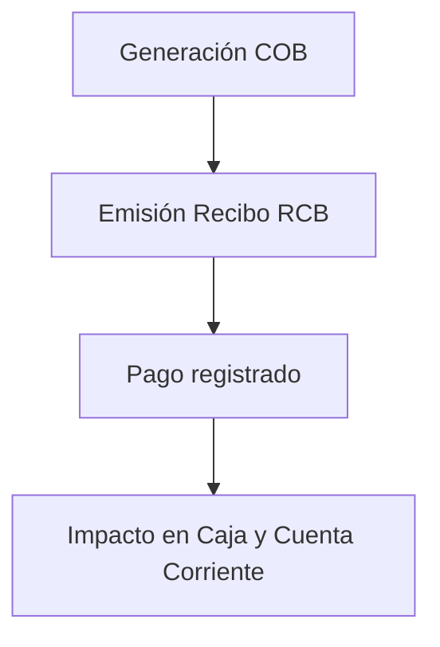
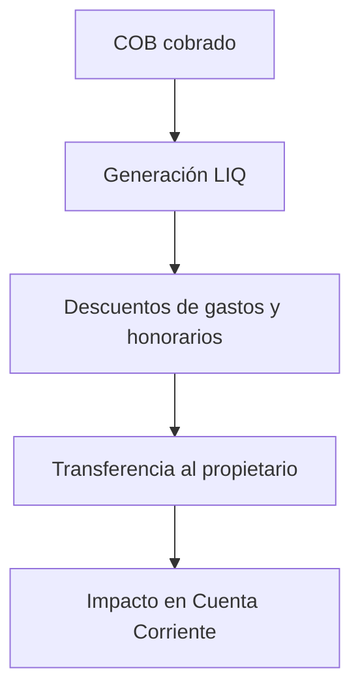

# Gestión Financiera

## 1. Objetivo
El módulo de **Gestión Financiera** centraliza la administración de **cuentas corrientes, comprobantes, cobranzas y liquidaciones** en la inmobiliaria. Su propósito es ofrecer control completo sobre el flujo financiero con inquilinos, propietarios, proveedores y la propia administración, asegurando trazabilidad, conciliación y reporting multimoneda.

---

## 2. Componentes Principales

### 2.1. Tipos de Comprobantes
Los comprobantes son la base del módulo y se dividen en:

#### a) Comprobantes Legales (AFIP)
- **Factura A/B/C (FAC):** Emisión a inquilinos o propietarios que requieren comprobante fiscal.
- **Notas de Débito (N/D) y Crédito (N/C):** Ajustes de facturación.
- Afectan siempre la **cuenta corriente** y pueden integrarse con AFIP.

#### b) Comprobantes Internos
- **Recibo X (Cobranza) – RCB:** Emisión al cobrar alquileres u otros conceptos. Afecta **cuenta corriente y caja**.
- **Recibo X (Pago) – RPG:** Para pagos internos o a proveedores. Afecta **cuenta corriente y caja**.
- **Cobranza (COB):** Comprobante automático mensual para alquileres, prorrateo, comisiones y gastos incluidos en contrato.
- **Liquidación (LIQ):** Liquidación automática de importes a propietarios.
- **Factura/ND/NC X:** Documentos internos no fiscales.
- **Resumen de Alquiler (ALQ):** Informe detallado para control interno del alquiler.

---

### 2.2. Cuentas Corrientes
- Cada cliente (inquilino, propietario o proveedor) posee una **cuenta corriente multimoneda**.
- Los comprobantes afectan automáticamente la cuenta corriente:
  - **Débitos:** Facturas, cobranzas, ND.
  - **Créditos:** Recibos, NC, liquidaciones.
- Las cuentas corrientes pueden filtrarse por **cliente, contrato y moneda**, evitando mezclar saldos.

**Características:**
- Visualización en tiempo real desde cliente y contrato.
- Saldo acumulado filtrado por moneda.
- Histórico de comprobantes asociados.

---

### 2.3. Caja y Movimientos (Gestión de Fondos)
- Los comprobantes con `affects_cash = true` generan automáticamente movimientos de caja.
- Ejemplos:
  - **Cobro de RCB:** Ingreso en caja.
  - **Pago RPG:** Egreso en caja.
- La caja se maneja separada de la cuenta corriente para permitir arqueos y control físico de fondos.

---

### 2.4. Procesos Automáticos
- **Generación mensual de COB:** Calcula renta, prorrateo, comisiones y gastos incluidos.
- **Liquidación de propietarios (LIQ):** Automática a partir de COB cobrados.
- **Aplicación de intereses por mora:** Se agregan en la cobranza siguiente.
- **Recuperos:** Servicios pagados por la inmobiliaria y luego cobrados a inquilino o descontados a propietario.

---

## 3. Reglas de Negocio

- **Numeración secuencial por tipo y punto de venta** para todos los comprobantes.
- Validación de **continuidad mensual en COB**: No puede generarse un COB si falta uno anterior.
- Los **RCB/RPG requieren pagos previos** cargados para su emisión, validando importes.
- En notas de crédito (N/C) y débito (N/D), debe definirse comprobante asociado.
- **Cobranzas multimoneda:** Se generan vouchers independientes por cada moneda.
- **Cancelación de comprobantes:** Revierte automáticamente movimientos asociados en caja y cuenta corriente.

---

## 4. Flujos Clave

### 4.1. Cobranza a Inquilino

### 4.2. Liquidación a Propietario

---

## 5. Tabla Comparativa de Comprobantes

| **Tipo**              | **Código** | **Letra** | **Afecta Cuenta Corriente** | **Afecta Caja** | **Uso Principal**                                                                                  |
|------------------------|------------|-----------|-----------------------------|-----------------|---------------------------------------------------------------------------------------------------|
| **Factura**           | FAC        | A/B/C/X   | Sí (débito)                | No              | Facturación fiscal (AFIP) o interna (X) a inquilinos, propietarios o proveedores.               |
| **Nota de Débito**    | N/D        | A/B/C/X   | Sí (débito)                | No              | Ajuste en más sobre una factura o sobre cuenta corriente.                                       |
| **Nota de Crédito**   | N/C        | A/B/C/X   | Sí (crédito)               | No              | Ajuste en menos sobre facturas o cobranzas.                                                    |
| **Recibo Cobranza**   | RCB        | X         | Sí (crédito)               | Sí (ingreso)    | Cobro de alquileres y otros conceptos a inquilinos.                                             |
| **Recibo Pago**       | RPG        | X         | Sí (débito)                | Sí (egreso)     | Pagos a proveedores o propietarios (fuera de liquidación).                                      |
| **Cobranza**          | COB        | X         | Sí (débito)                | No (al emitir)  | Generación mensual automática de alquileres, prorrateo, comisiones y gastos incluidos.          |
| **Liquidación**       | LIQ        | X         | Sí (crédito)               | No (salvo pago) | Transferencia de rentas netas a propietarios.                                                  |
| **Resumen Alquiler**  | ALQ        | X         | No                          | No              | Reporte interno informativo de desglose de alquiler.                                           |
