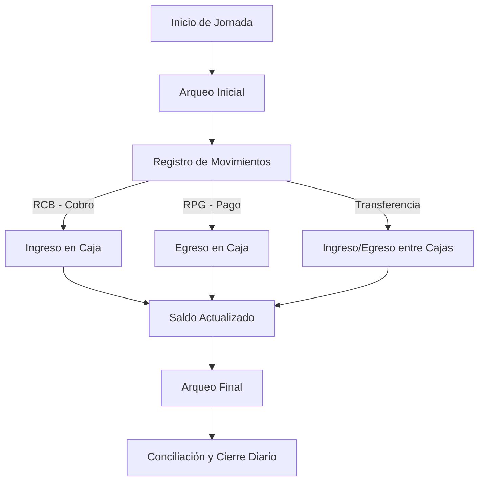

# Gestión de Fondos

## 1. Objetivo
El módulo de **Gestión de Fondos** administra el efectivo y cuentas de la inmobiliaria, registrando ingresos y egresos, controlando saldos y arqueos, y permitiendo transferencias internas entre cajas. Está integrado con la **Gestión Financiera**, de modo que todos los comprobantes que afectan caja generan automáticamente movimientos.

---

## 2. Componentes Principales

### 2.1. Cajas (Cash Accounts)
- Representan cuentas físicas o virtuales de fondos:
  - Ejemplo: Caja Principal, Banco Nación ARS, Banco Galicia USD.
- Cada caja incluye:
  - **Nombre.**
  - **Moneda (ARS, USD, etc.)**.
  - **Estado** (activa/inactiva).
- Se permite filtrar por cajas activas.

**Funcionalidades:**
- Alta, baja y edición de cajas.
- Consulta de saldo actualizado en tiempo real.
- Visualización de movimientos históricos.

---

### 2.2. Movimientos de Caja (Cash Movements)
- Registra todos los ingresos y egresos vinculados a caja.
- Soporta transferencias internas entre cajas de la misma moneda.

**Atributos:**
- Fecha.
- Tipo: ingreso, egreso, transferencia interna.
- Monto y moneda.
- Concepto y detalle.
- Caja origen/destino en caso de transferencias.

**Origen Automático:**
- Comprobantes con `affects_cash = true` generan movimientos automáticos:
  - **RCB (Recibo Cobranza):** ingreso.
  - **RPG (Recibo Pago):** egreso.
  - **LIQ (Liquidación):** egreso si se paga por caja.

---

### 2.3. Arqueo de Caja
- Control diario de efectivo:
  - Conteo físico vs. saldo teórico.
  - Registro de diferencias (faltantes/sobrantes).
- Permite ajustes manuales documentados.

**Frecuencia recomendada:**
- Al inicio y fin de cada jornada.

---

## 3. Integración con Gestión Financiera
- Los movimientos de caja son **consecuencia directa** de la emisión de comprobantes internos:
  - **Cobranzas (RCB)** → ingreso en caja.
  - **Pagos (RPG)** → egreso en caja.
  - **Liquidaciones (LIQ)** → egreso (si se paga desde caja).
- Caja no afecta directamente cuentas corrientes: su impacto es indirecto vía comprobantes.

---

## 4. Reglas de Negocio
- **Multimoneda:** Cada caja está vinculada a una moneda. No se mezclan saldos entre monedas.
- **Transferencias internas:** Crean dos movimientos: egreso en origen, ingreso en destino.
- **Conciliación obligatoria:** Solo cajas conciliadas pueden cerrarse.
- **Edición y eliminación:** Permitidas solo si el movimiento no está conciliado.
- **Arqueo obligatorio:** Antes de cierre contable o cambio de responsable.

---

## 5. Flujo Operativo

---

## 6. Funcionalidades Clave
- **Listado de Cajas:** con saldo actual y opción de filtrar activas.
- **Listado de Movimientos:** con filtros por fecha, tipo, caja y moneda.
- **Transferencias internas:** automatizadas y doble asiento (origen/destino).
- **Arqueos:** registro de conteo físico y ajustes.
- **Reportes diarios:** resumen de ingresos, egresos y saldo final.
