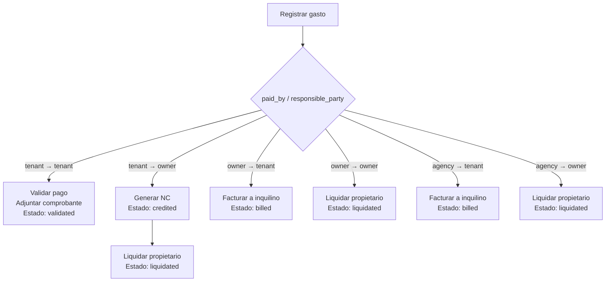

# Módulo: Gestión de Gastos (Contract Expenses) 
2025-08-05

## 1️⃣ Objetivo
El módulo de **Gestión de Gastos** permite registrar, controlar y vincular los gastos asociados a contratos de alquiler. Su objetivo es garantizar que cada gasto se procese correctamente según su origen (`paid_by`) y responsabilidad (`responsible_party`), integrándose con los procesos de facturación a inquilinos y liquidación a propietarios.

---

## 2️⃣ Estados de un gasto (ContractExpenseStatus)
1. **`pending`**  
   - Gasto registrado, aún no validado ni vinculado a comprobantes.

2. **`validated`**  
   - Aplica únicamente a `tenant → tenant`.
   - Se valida comprobante de pago cargado por el inquilino.

3. **`billed`**  
   - Gasto facturado al inquilino vía `FAC/N/D`.
   - Aplica a: `owner → tenant` y `agency → tenant`.

4. **`credited`**  
   - Generación de Nota de Crédito al inquilino.
   - Aplica únicamente a: `tenant → owner`.

5. **`liquidated`**  
   - Gasto liquidado al propietario en una liquidación (`LIQ`).
   - Aplica a: `tenant → owner`, `owner → owner` y `agency → owner`.

6. **`canceled`**  
   - Gasto anulado, sin impacto contable.

---

## 3️⃣ Combinaciones `paid_by` y `responsible_party`

| Pagado por (`paid_by`) | Responsable (`responsible_party`) | Acción                         | Estados implicados                |
|------------------------|-----------------------------------|--------------------------------|-----------------------------------|
| tenant                | tenant                            | Validar pago.                  | `pending` → `validated`          |
| tenant                | owner                             | Generar NC y liquidar.         | `pending` → `credited` → `liquidated` |
| owner                 | tenant                            | Facturar al inquilino.         | `pending` → `billed`             |
| owner                 | owner                             | Liquidar al propietario.       | `pending` → `liquidated`         |
| agency                | tenant                            | Facturar al inquilino.         | `pending` → `billed`             |
| agency                | owner                             | Liquidar al propietario.       | `pending` → `liquidated`         |

---

## 4️⃣ Reglas de edición
- **Editable**:
  - Estados `pending` y `validated` (con restricciones).
- **Bloqueo de campos** en `validated`:
  - No se pueden modificar `paid_by` ni `responsible_party`.
- **Bloqueado**:
  - Estados `billed`, `credited` y `liquidated`.

---

## 5️⃣ Significado de campos clave
- **`effective_date`**: fecha en que corresponde imputar el gasto (para reportes y agrupación por período).
- **`voucher_id`**: referencia al comprobante generado (si fue facturado).
- **`generated_credit_note_id`**: referencia a NC generada (si aplica `tenant → owner`).
- **`liquidation_voucher_id`**: referencia a liquidación del propietario (si aplica).
- **`is_paid` / `paid_at`**: registro del pago efectivo (usado solo en `tenant → tenant`).

---

## 6️⃣ Flujos principales

### Registro de gasto
1. Alta de gasto desde pantalla de gestión.
2. Definición de:
   - Contrato (`contract_id`).
   - Servicio (`service_type_id`).
   - Monto y moneda (`amount`, `currency`).
   - `paid_by` y `responsible_party`.
   - Fecha efectiva (`effective_date`).

### Validación (`tenant → tenant`)
- Adjuntar comprobante.
- Registrar fecha de pago (`paid_at`).
- Cambiar estado a `validated`.

### Facturación (`owner/agency → tenant`)
- Gasto incluido en la cobranza mensual (`FAC/N/D`).
- Estado pasa a `billed`.
- Se vincula `voucher_id`.

### Nota de crédito (`tenant → owner`)
- Generar NC al inquilino (`credited`).
- Luego incluir en liquidación al propietario (`liquidated`).

### Liquidación al propietario
- Gastos `tenant → owner`, `owner → owner` y `agency → owner` se liquidan en `LIQ`.

### Cancelación
- Estado `canceled`, sin impacto en procesos posteriores.

---

## 7️⃣ Pantalla: Gestión de Gastos
- **Listado** (`ContractExpenseTable.vue`):
  - Columnas: Fecha, Servicio, Monto, Pagado por, Responsable, Estado, Acciones.
  - Acciones:
    - Editar (si editable).
    - Eliminar (si editable).
    - Registrar pago (solo `tenant → tenant`).
    - Adjuntar comprobantes.
- **Formulario** (`ContractExpenseForm.vue`):
  - Alta/edición de gastos con validaciones según estado.
- **Modal pago** (`ContractExpensePaymentModal.vue`):
  - Adjuntar comprobante y registrar pago en `tenant → tenant`.

---

## 8️⃣ Integraciones técnicas
- **Backend**:
  - Modelo `ContractExpense` con relaciones a `Contract`, `Voucher`, adjuntos y enums.
  - Endpoints:
    - `POST /contract-expenses` → Alta.
    - `PATCH /contract-expenses/{id}` → Edición controlada.
    - `POST /contract-expenses/{id}/register-payment` → Validación pago inquilino.
- **Frontend**:
  - Componentes: `ContractExpenseTable.vue`, `ContractExpenseForm.vue`, `ContractExpensePaymentModal.vue`.
  - Chips de estado y bloqueo dinámico de campos.

---

## 9️⃣ Diagrama de flujo (Mermaid)

---

## 🔟 Casos especiales
- Gastos fuera del período: se imputan según `effective_date`.
- Gastos validados sin comprobante: bloqueo hasta adjuntar archivo.
- Relación con cobranzas:
  - Solo `owner → tenant` y `agency → tenant` impactan en la deuda del inquilino.
- Relación con liquidaciones:
  - `tenant → owner`, `owner → owner`, `agency → owner` se liquidan al propietario.

---
