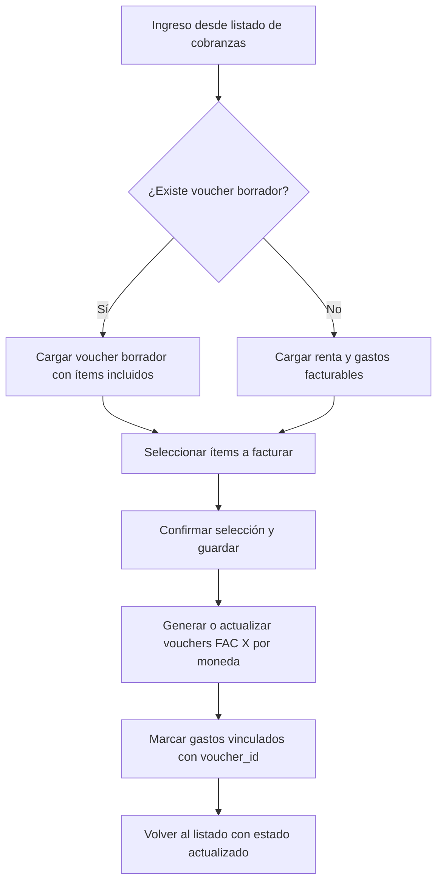

# Pantalla: Editor de Cobranza

## 1️⃣ Objetivo
La pantalla de **Editor de Cobranza** permite generar, visualizar y editar la composición de una cobranza para un contrato y período específico.  
Integra la renta del contrato y los gastos facturables al inquilino, mostrando qué ítems están incluidos en vouchers borrador o nuevos, permitiendo seleccionar o deseleccionar ítems antes de confirmar.

---

## 2️⃣ Funcionalidades principales
- **Visualización del detalle de la cobranza**:
  - Renta calculada del período.
  - Gastos facturables agrupados por moneda.
  - Ítems ya incluidos en vouchers borrador (marcados como incluidos).
- **Selección manual de ítems**:
  - Checkbox para agregar/quitar ítems a la cobranza.
  - Edición de montos antes de confirmar (si permitido).
- **Gestión de vouchers borrador**:
  - Si existe un voucher en borrador, se carga automáticamente y permite su edición.
  - Permite agregar nuevos ítems (gastos posteriores).
- **Confirmación y generación**:
  - Al confirmar, genera o actualiza vouchers (`FAC X`) agrupados por moneda.
  - Marca los gastos seleccionados como incluidos (`voucher_id`).

---

## 3️⃣ Elementos de interfaz
### Encabezado:
- Contrato (`CON-XXXX`), inquilino y período (`YYYY-MM`).
- Estado actual de la cobranza (`pending`, `draft`, `issued`).
- Botones:
  - **Guardar cambios** (genera/actualiza vouchers).
  - **Cancelar** (volver al listado).

### Tabla de ítems:
- Columnas:
  - **[✓] Checkbox**: seleccionar/deseleccionar ítem.
  - **Descripción**: Renta del período o concepto de gasto.
  - **Monto**: editable solo para nuevos ítems.
  - **Moneda**: asociada al contrato o gasto.
  - **Estado**:
    - "Incluido en borrador"
    - "Nuevo"
    - "Emitido" (no editable).

---

## 4️⃣ Reglas de negocio
- La renta siempre se incluye automáticamente y no puede desmarcarse.
- Los gastos `owner → tenant` y `agency → tenant` son seleccionables para facturar.
- Gastos `tenant → tenant` o `tenant → owner` no aparecen aquí (se gestionan fuera de la cobranza).
- Si existen vouchers en estado `issued`, los ítems emitidos se muestran bloqueados.
- Permite agregar **punitorios** manuales como nuevos ítems si la cobranza está atrasada.

---

## 5️⃣ Flujos de uso

### A. Cobranza inicial
1. El usuario accede al editor desde el listado de cobranzas.
2. El sistema muestra:
   - Renta calculada del período.
   - Gastos facturables sin voucher.
3. El usuario selecciona los ítems deseados y confirma.
4. Se generan vouchers `FAC X` (uno por moneda).

### B. Edición de borrador
1. Si ya existe un voucher en `draft`, se carga en el editor.
2. El usuario puede:
   - Quitar ítems no deseados.
   - Agregar nuevos gastos facturables posteriores.
3. Al confirmar, actualiza el voucher borrador existente.

### C. Gastos posteriores
1. Si surgen nuevos gastos tras generar un borrador, se listan como "Nuevos".
2. El usuario puede agregarlos al voucher borrador.
3. Si el voucher ya está `issued`, los nuevos gastos generan una `N/D`.

---

## 6️⃣ Integraciones técnicas

### Backend:
- **Endpoints:**
  - `GET /collections/{contract}/editor?period=YYYY-MM`: carga inicial de datos.
  - `POST /collections/{contract}/generate`: genera vouchers por moneda.
  - `PATCH /vouchers/{id}`: actualiza borrador existente.
- **Servicios:**
  - `ContractBillingService`: cálculo de renta y gastos.
  - `VoucherGenerationService`: generación de vouchers y vinculación de gastos.

### Frontend:
- **Componentes:**
  - `CollectionEditor.vue`: UI principal.
  - `ItemSelector.vue`: tabla de ítems con checkboxes.
  - `PunitoriosForm.vue`: cálculo y carga manual de punitorios.
- **Acciones:**
  - `@save`: genera o actualiza vouchers.
  - `@cancel`: vuelve al listado.

---

## 7️⃣ Diagrama de flujo (Mermaid)

---

## 8️⃣ Casos especiales
- **Ajustes pendientes**: bloqueo de editor hasta que se aplique el ajuste.
- **Punitorios dinámicos**: pueden agregarse manualmente como ítems adicionales antes de guardar.
- **Gastos multi-moneda**: generan vouchers separados automáticamente.
- **Contratos vencidos**: no pueden generar cobranzas fuera de vigencia.

---
