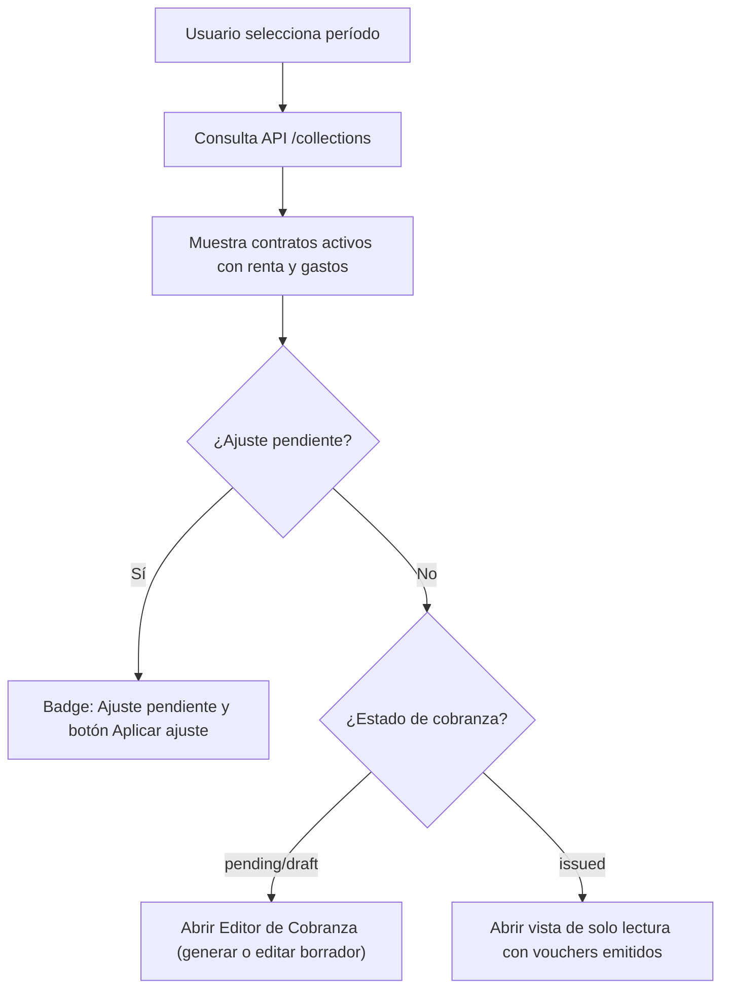

# Pantalla: Listado de Cobranzas

2025-08-05

## 1️⃣ Objetivo
La pantalla de **Listado de Cobranzas** centraliza la visualización y control de todas las cobranzas generadas por contrato y período.  
Permite al usuario identificar el estado de cada cobranza, gestionar ajustes pendientes, generar nuevas cobranzas, y visualizar información clave sobre renta y gastos incluidos.

---

## 2️⃣ Funcionalidades principales
- **Visualizar cobranzas por contrato y período**, con detalle de renta y gastos facturables.
- **Filtrar y buscar** por:
  - Período (`YYYY-MM`).
  - Estado (`pending`, `pending_adjustment`, `draft`, `issued`).
  - Contrato (código o ID).
  - Inquilino (nombre o documento).
  - Moneda (`ARS`, `USD`).
- **Identificar ajustes pendientes** que bloquean la generación de cobranza.
- **Generar nuevas cobranzas** manualmente.
- **Acceder a la gestión de ajustes** cuando corresponda.
- **Visualizar gastos agrupados por moneda** y su vinculación a vouchers.

---

## 3️⃣ Columnas del listado
1. **Contrato**:  
   - Código formateado (`CON-XXXX`).
   - Link al detalle del contrato.
2. **Inquilino**:  
   - Nombre completo (razón social si es empresa).
3. **Período**:  
   - Formato `YYYY-MM`.
4. **Renta**:  
   - Monto calculado del período, en la moneda del contrato.
   - Si hay ajuste pendiente: muestra badge **"Ajuste pendiente"**.
5. **Gastos**:  
   - Listado agrupado por moneda:  
     Ejemplo:
     ```
     ARS: $25.000
     USD: U$D 150
     ```
6. **Estado de cobranza**:
   - `pending`: No generada.
   - `pending_adjustment`: Ajuste pendiente.
   - `draft`: Voucher borrador o gastos no vinculados.
   - `issued`: Todos los ítems emitidos.
7. **Acciones**:
   - **Aplicar ajuste** (redirige al módulo de ajustes).
   - **Generar cobranza** (abre editor o ejecuta generación directa).

---

## 4️⃣ Filtros disponibles
- **Período** (obligatorio): `YYYY-MM`.
- **Estado**: combo (`pending`, `pending_adjustment`, `draft`, `issued`).
- **Contrato**: búsqueda directa por ID/código.
- **Inquilino**: texto libre (nombre o documento).
- **Moneda**: selector (`ARS`, `USD`).

---

## 5️⃣ Estados de cobranza
Los estados se determinan según el `CollectionResource`:

- **`pending_adjustment`**: contrato con ajuste pendiente; bloquea generación.
- **`pending`**: contrato activo, sin cobranzas generadas.
- **`draft`**: existe voucher borrador o gastos pendientes de incluir.
- **`issued`**: todos los ítems facturables están incluidos en vouchers emitidos.

---

## 6️⃣ Acciones
- **Aplicar ajuste**:
  - Disponible solo en estado `pending_adjustment`.
  - Redirige al módulo de ajustes filtrado por contrato.

- **Editar cobranza**:
  - Disponible en estados `pending` y `draft`.
  - Abre el **Editor de Cobranza** para generar o actualizar vouchers borrador.

- **Ver cobranza emitida**:
  - Disponible en estado `issued`.
  - Abre una vista de solo lectura con vouchers emitidos e ítems incluidos.

---

## 7️⃣ Integración técnica

### Backend
- Endpoint: `GET /collections`
  - Parámetros:
    - `period` (YYYY-MM) [requerido].
    - `status`, `contract_id`, `client_id`, `currency`, `page`, `per_page`.
  - Devuelve `CollectionResource` paginado con:
    - `contract_id`, `contract_code`, `tenant_name`
    - `period`, `currency`
    - `rent_amount`
    - `expenses` (agrupados por moneda)
    - `has_pending_adjustment`
    - `status`.

### Frontend
- Componente: `CollectionTable.vue`:
  - Soporte para filtros, paginación y orden.
  - Chips de estado con colores (`pending_adjustment: orange`, `pending: red`, `draft: blue-grey`, `issued: green`).
  - Acciones: `@generate`, `@apply-adjustment`.
- Vista contenedora: `CollectionIndex.vue`:
  - Barra de filtros.
  - Manejo de eventos de acciones.
  - Redirección a editor de cobranzas o módulo de ajustes.

---

## 8️⃣ Diagrama de flujo (Mermaid)


---

## 9️⃣ Casos especiales
- **Contratos vencidos:** no se listan fuera del rango de vigencia.
- **Ajuste pendiente:** bloquea generación hasta aplicarse.
- **Gastos multi-moneda:** se generan vouchers separados por moneda.

---
